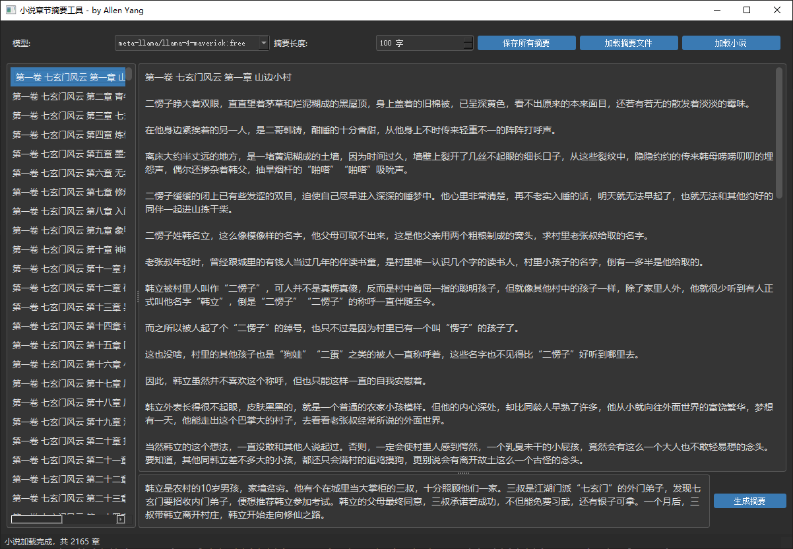

# TitanSummarizer - 小说章节摘要工具

TitanSummarizer是一个使用大型语言模型自动生成小说章节摘要的桌面应用程序，由Allen Yang开发。



## 功能特点

- **智能章节解析**: 自动识别并解析小说章节结构
- **多模型支持**: 支持多种大型语言模型生成摘要，包括:
  - Meta Llama 4 Maverick/Scout
  - DeepSeek V3
  - Google Gemini
  - OpenAI GPT-4.5/O1系列
- **摘要长度控制**: 可自定义摘要字数(50-500字)
- **本地保存**: 自动保存已生成的摘要，下次打开自动载入
- **多编码支持**: 自动识别UTF-8、GBK和GB18030编码的小说文件
- **简洁直观的界面**: 三区布局，操作简单明了

## 界面说明

- **顶部控制区域**: 
  - 模型选择下拉框(支持自定义输入模型ID)
  - 摘要长度调节
  - 保存/加载摘要功能
  - 加载小说文件按钮
- **左侧章节导航区**: 显示识别到的所有小说章节
- **右侧内容区域**: 
  - 上部: 显示当前选中章节的内容
  - 下部: 显示/编辑当前章节的摘要
  - "生成摘要"按钮: 使用AI模型生成当前章节摘要

## 安装与使用

### 环境要求
- Python 2.x
- PyQt5
- OpenAI API客户端1.0+

### 安装依赖

```
pip install -r requirements.txt
```

### 使用方法

```
python novel_summarizer.py
```

### 推荐使用步骤

1. 启动程序，默认加载`novels/凡人修仙传.txt`
2. 从左侧章节列表选择您想要摘要的章节
3. 查看右上区域中的章节内容
4. 设置合适的摘要长度(默认100字)
5. 点击"生成摘要"按钮，稍等片刻即可在下方看到AI生成的摘要
6. 您可以手动编辑摘要，所有修改会自动保存
7. 点击"保存所有摘要"按钮将摘要导出为JSON文件，方便下次使用

## 技术实现

- **UI框架**: PyQt5
- **API接口**: OpenRouter API (支持多种主流大语言模型)
- **默认模型**: Meta Llama 4 Maverick
- **文本处理**: 基于正则表达式的章节提取算法

## 自定义说明

- 您可以在`novels`目录下放置自己的txt格式小说文件
- 摘要文件会自动保存为与小说同名的_summaries.json文件
- 可在界面中直接输入任何OpenRouter支持的模型ID

## 关于作者

TitanSummarizer由Allen Yang开发，旨在提供一个简单易用的工具，帮助小说爱好者快速理解和回顾小说内容。 